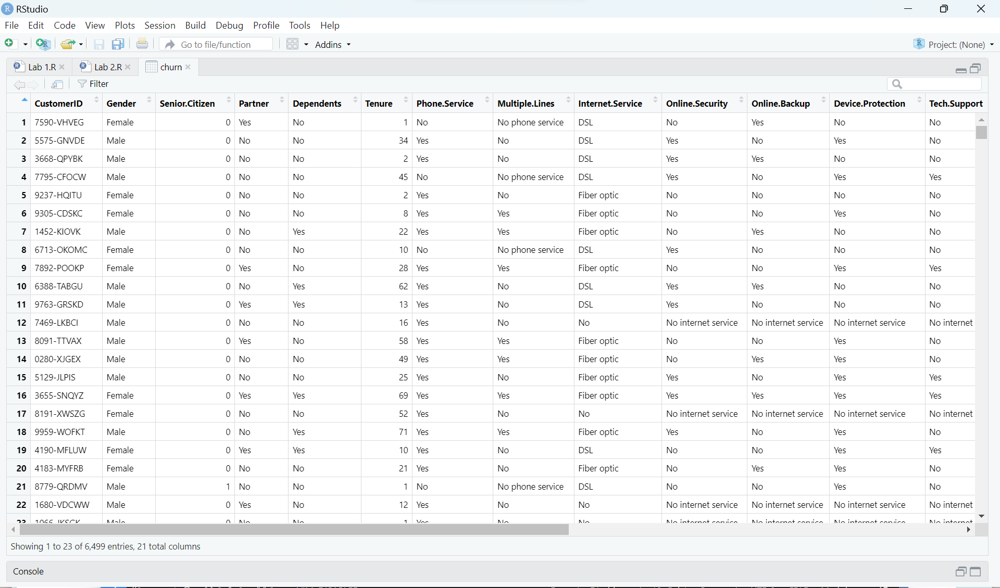
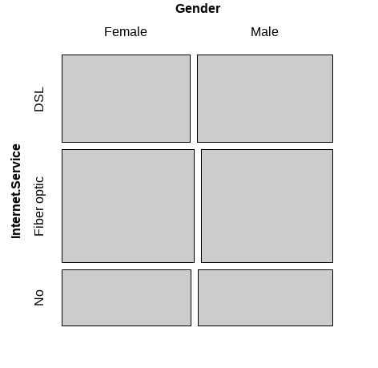

# Lab 2 - Data Science

```r
# Read the CSV file
churn <- read.csv("Churn_Train.csv", header = TRUE)

# View the dataframe
View(churn)
```


```r
# Test of normality
# if p-value is less than 0.05, it indicates that the variables do not follow a normal distribution
normality_test <- normality(churn)
print(normality_test)

# Visualization of normality
plot_normality(churn)
```


```r
# Select only numeric columns for correlation calculation
numeric_columns <- churn %>% select(where(is.numeric))

# Calculation of correlation coefficient using cor()
correlation_matrix <- cor(numeric_columns, use = "complete.obs", method = "pearson")

# Print the correlation matrix
print(correlation_matrix)

# Visualize the correlation matrix using corrplot
corrplot::corrplot(correlation_matrix, method = "circle")
```


```r
# Perform EDA based on target variables
# Grouping data by Internet Service
categ <- target_by(churn, Internet.Service)

# Analyze the relationship
cat_num <- relate(categ, Tenure)
summary(cat_num)
plot(cat_num)

# Adjust the plotting area
par(mar = c(5, 4, 4, 2) + 0.1)

# Create a mosaic plot
mosaic(~ Internet.Service + Gender, data = churn)
```
