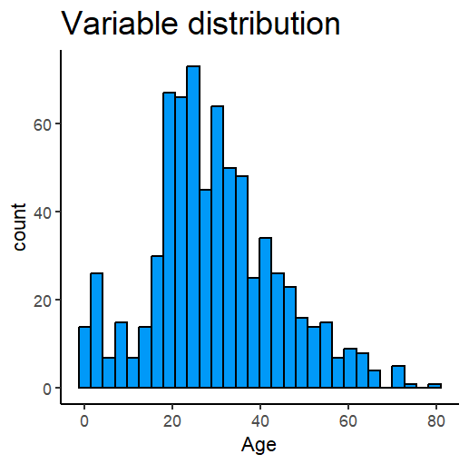
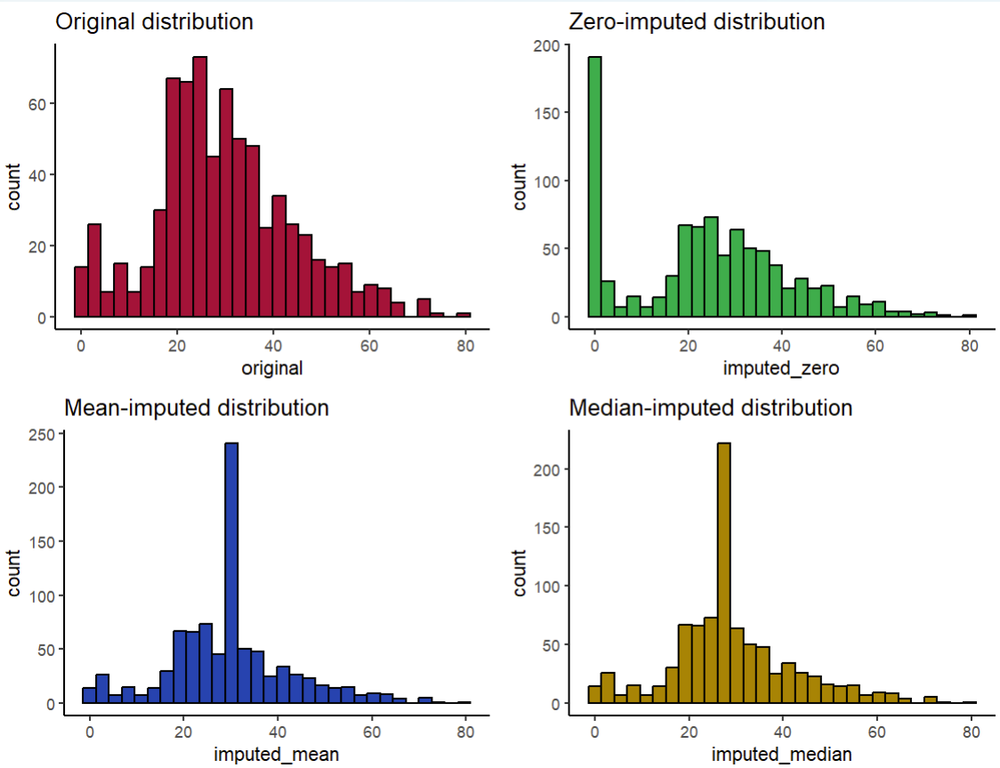
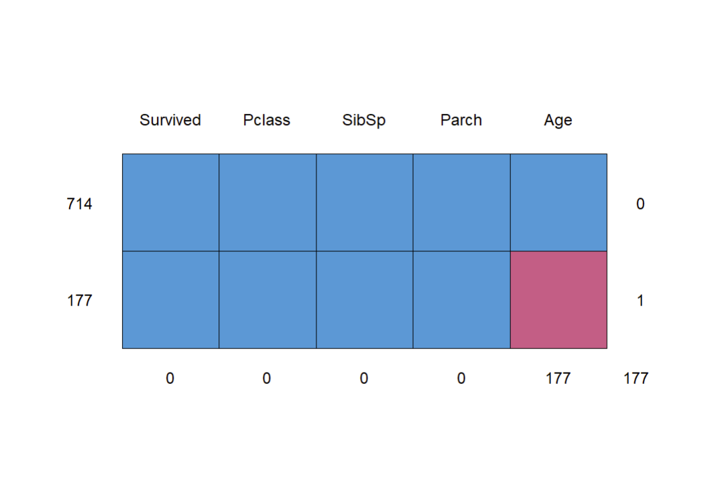
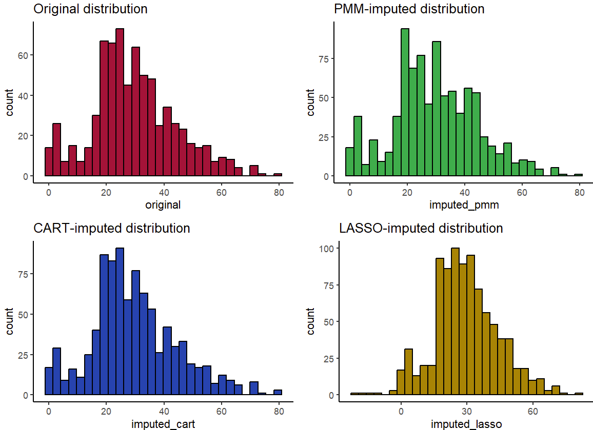
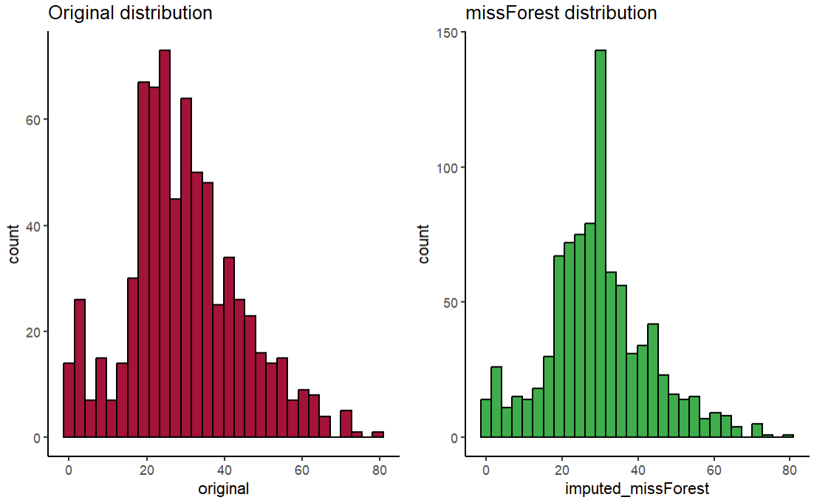
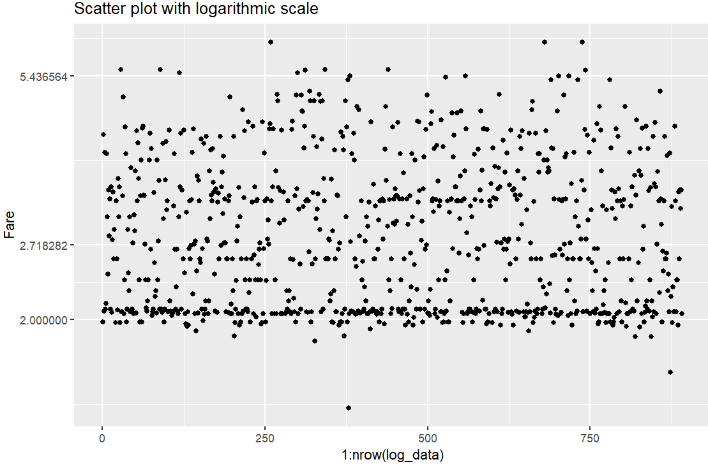

# Lab 3 Documentation

'''r

library(ggplot2)
library(dplyr)
library(cowplot)

# Load the titanic_train dataset from the titanic package vignette
data("titanic_train", package = "titanic")

ggplot(titanic::titanic_train, aes(x = Age)) +
  geom_histogram(color = "#000000", fill = "#0099F8") +
  ggtitle("Variable distribution") +
  theme_classic() +
  theme(plot.title = element_text(size = 18))

'''r

'''r

h1 <- ggplot(value_imputed, aes(x = original)) +
  geom_histogram(fill = "#ad1538", color = "#000000", position = 
                   "identity") +
  ggtitle("Original distribution") +
  theme_classic()
h2 <- ggplot(value_imputed, aes(x = imputed_zero)) +
  geom_histogram(fill = "#15ad4f", color = "#000000", position = 
                   "identity") +
  ggtitle("Zero-imputed distribution") +
  theme_classic()
h3 <- ggplot(value_imputed, aes(x = imputed_mean)) +
  geom_histogram(fill = "#1543ad", color = "#000000", position = 
                   "identity") +
  ggtitle("Mean-imputed distribution") +
  theme_classic()
h4 <- ggplot(value_imputed, aes(x = imputed_median)) +
  geom_histogram(fill = "#ad8415", color = "#000000", position = 
                   "identity") +
  ggtitle("Median-imputed distribution") +
  theme_classic()
plot_grid(h1, h2, h3, h4, nrow = 2, ncol = 2)

'''r

'''r
install.packages('mice')
library(mice)
titanic_numeric <- titanic_train %>%
  select(Survived, Pclass, SibSp, Parch, Age)
md.pattern(titanic_numeric)

'''r

'''r
h01 <- ggplot(mice_imputed, aes(x = original)) +
  geom_histogram(fill = "#ad1538", color = "#000000", position =
                   "identity") +
  ggtitle("Original distribution") +
  theme_classic()
h02 <- ggplot(mice_imputed, aes(x = imputed_pmm)) +
  geom_histogram(fill = "#15ad4f", color = "#000000", position =
                   "identity") +
  ggtitle("PMM-imputed distribution") +
  theme_classic()
h03 <- ggplot(mice_imputed, aes(x = imputed_cart)) +
  geom_histogram(fill = "#1543ad", color = "#000000", position =
                   "identity") +
  ggtitle("CART-imputed distribution") +
  theme_classic()
h04 <- ggplot(mice_imputed, aes(x = imputed_lasso)) +
  geom_histogram(fill = "#ad8415", color = "#000000", position =
                   "identity") +
  ggtitle("LASSO-imputed distribution") +
  theme_classic()
plot_grid(h01, h02, h03, h04, nrow = 2, ncol = 2)

'''r
h0m1 <- ggplot(missForest_imputed, aes(x = original)) +
  geom_histogram(fill = "#ad1538", color = "#000000", position =
                   "identity") +
  ggtitle("Original distribution") +
  theme_classic()
h0m2 <- ggplot(missForest_imputed, aes(x = imputed_missForest)) +
  geom_histogram(fill = "#15ad4f", color = "#000000", position =
                   "identity") +
  ggtitle("missForest distribution") +
  theme_classic()

plot_grid(h0m1, h0m2, nrow = 1, ncol = 2)

'''r
library(titanic)
log_scale<-log(titanic_train$Fare)

log_data<-data.frame(Fare=log_scale)

ggplot(log_data, aes(x=1:nrow(log_data), y=Fare)) +
  geom_point()+
  scale_y_continuous(trans='log')+
  ggtitle("Scatter plot with logarithmic scale")

'''r
